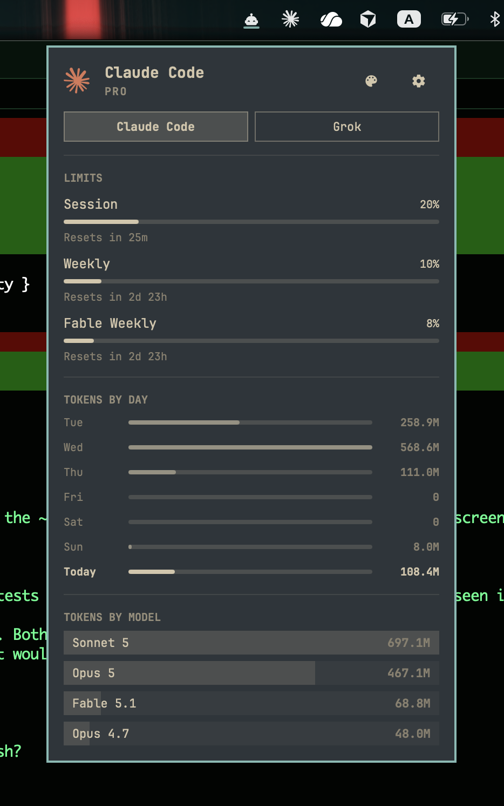
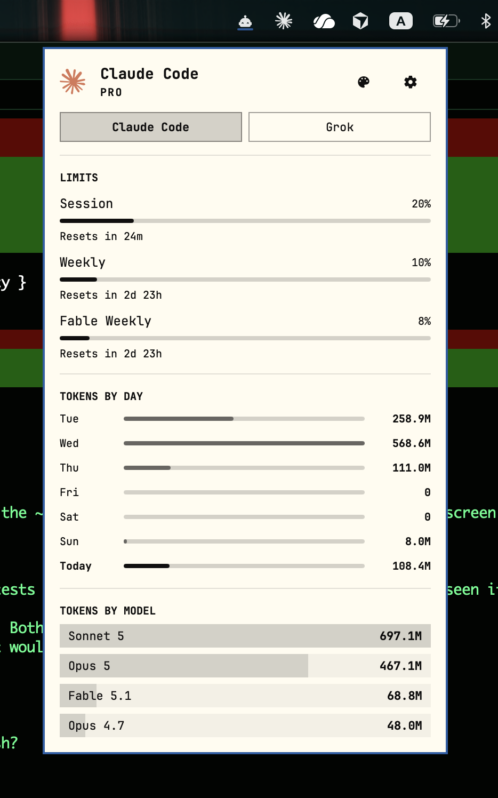
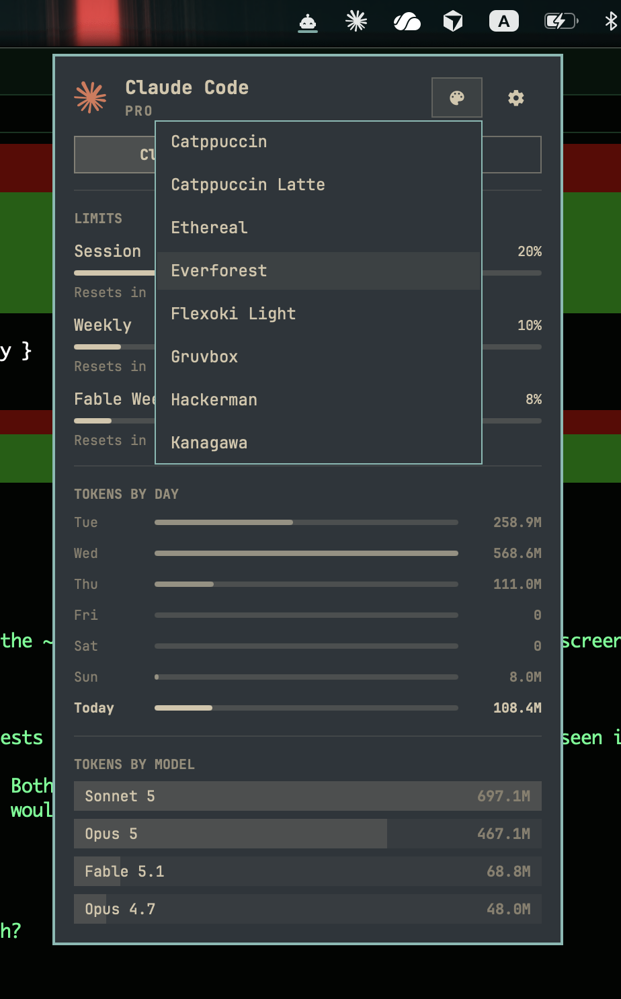
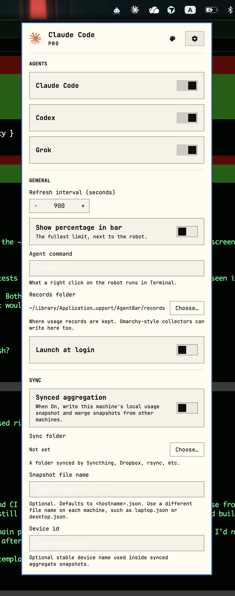

# AgentBar

A macOS menu bar port of Omarchy's built-in agents widget. Same interface, same behaviour, because I missed it on my Mac.

Not affiliated with or endorsed by Omarchy or 37signals.

[](https://github.com/sammathew4444/AgentBar/actions/workflows/ci.yml)

<p>
  
  
</p>

## What it shows

Click the robot in the menu bar for a panel with, for each AI coding agent you use:

- **Limits:** session, weekly and model-scoped allowances, with the time until each resets. The robot turns red when one passes 90%.
- **Tokens by day:** the last seven days, today in bold. Hover a day for its prompt and session count.
- **Tokens by model:** your four heaviest models. Hover for the input, output and cache split.

| Agent | Limits come from | Token counts come from |
|---|---|---|
| Claude Code | Anthropic's usage endpoint, with your Claude Code sign-in | `~/.claude` transcripts |
| Codex | Your own `codex` app-server | `~/.codex` sessions (last 30 days) |
| Grok | Grok's own log of your credit allowance, as of your last Grok session | `~/.grok` sessions |

It looks like Omarchy's widget, defaults to Omarchy's Tokyo Night theme, and has all 22 Omarchy
themes (or any Omarchy theme folder) one click away. It can also merge usage from your other
machines, Macs or Omarchy, through a synced folder.

<p>
  
  
</p>

## Requirements

- macOS 14 (Sonoma) or later, Apple silicon or Intel
- At least one of: Claude Code (signed in), the Codex CLI, the Grok CLI

## Install

AgentBar is a hobby project, published here for anyone who wants to try it. It isn't signed with a
Developer ID or notarized, and it isn't in the App Store or Homebrew.

**Download:** get `AgentBar-<version>.zip` from [Releases](https://github.com/sammathew4444/AgentBar/releases),
unzip it and move `AgentBar.app` to Applications. Each zip has a `.sha256` next to it. Because the
app isn't notarized, macOS won't open it the first time. Allow it in System Settings › Privacy &
Security › Open Anyway, or run:

```sh
xattr -dr com.apple.quarantine /Applications/AgentBar.app
```

**Or build from source** with Swift 6 (Xcode 16 or later):

```sh
git clone https://github.com/sammathew4444/AgentBar.git && cd AgentBar
swift build && ./Scripts/bundle.sh && open AgentBar.app
```

**On first launch:**

- The robot appears in the menu bar once AgentBar has found usage for at least one agent, as in
  Omarchy. On a Mac that has never run Claude Code, Codex or Grok, it stays hidden.
- macOS may ask whether `security` can use your "Claude Code-credentials" Keychain item. That's
  AgentBar reading your Claude Code sign-in to fetch your limits. "Always Allow" stops it asking
  every refresh; you can revoke it in Keychain Access.

## Using it

| Do | To |
|---|---|
| Click the robot | Open or close the panel |
| Right-click the robot | Open Terminal running your agent (`claude` by default) |
| Middle-click or scroll on the robot, or h / l or ← / → in the panel | Switch agents |
| r, Enter or Space | Refresh now |
| j / k or ↓ / ↑ | Scroll the settings page, or move through the theme list |
| Esc | Close the theme list, the settings page, then the panel |
| ⌘Q, or Quit AgentBar in settings | Quit |

The palette button picks a theme. The gear opens settings: which agents to show, the refresh
interval, a percentage next to the robot, the agent command, where records are kept, launch at
login, and synced aggregation.

## Privacy

AgentBar makes one network request of its own, for your Claude limits, to Anthropic. It has no
telemetry, and it only reads your agents' files, never writes them. Your Claude sign-in token stays
in memory and goes only to Anthropic. [SECURITY.md](SECURITY.md) lists every file it reads and
writes, every program it runs, and what goes where.

## Uninstall

Quit AgentBar (⌘Q with the panel open, or Quit in settings), turn off Launch at login if you turned
it on, then:

```sh
rm -rf /Applications/AgentBar.app \
  ~/Library/Application\ Support/AgentBar \
  ~/Library/Caches/AgentBar
defaults delete io.github.sammathew4444.AgentBar
```

If you allowed Keychain access, you can remove `security` from the "Claude Code-credentials" item
in Keychain Access.

## Known limitations

- **Grok's limit** is only as fresh as your last Grok session, because Grok writes it to its own
  log only while it runs. AgentBar drops it once the billing period ends.
- **Codex limits** need the `codex` command installed and signed in. Without it you still get
  Codex token counts.
- **Codex "all-time"** covers session files from the last 30 days, as in Omarchy.
- Omarchy's third agent, **Fireworks**, isn't ported.
- The settings page scrolls on short screens; the usage panel is capped at 90% of the screen height.

## How it's built

A Swift 6 menu bar app (AppKit for the menu bar, SwiftUI for the panel) with no third-party
dependencies. `reference/` holds the Omarchy sources it's ported from, pinned to a commit (see
`reference/PROVENANCE.md`). Where it deliberately differs from Omarchy, the code comments say so.
The collectors match Omarchy's record format, so the same numbers come out, and records from
Omarchy-ecosystem collectors can be dropped into the records folder.

It was written with [Claude Code](https://claude.com/claude-code). Tests: `swift test`. Releases:
`docs/RELEASING.md`.

## License

MIT. Portions derived from Omarchy (MIT), Copyright (c) David Heinemeier Hansson. The bundled
JetBrainsMono Nerd Font is under the SIL Open Font License. See `LICENSE`.
